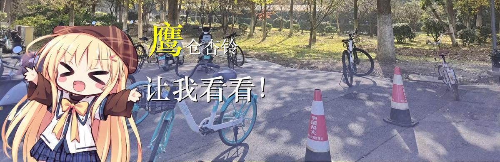

# Text_Box_for_Galgame

一个将文本转换为类似Galgame对话风格图片的程序。

> 本项目灵感来源于 [manosaba_text_box](https://github.com/oplivilqo/manosaba_text_box)，代码基于 [Text_box-of-mahoushoujo_no_majosaiban-NEO](https://github.com/morpheus315/Text_box-of-mahoushoujo_no_majosaiban-NEO) 这一二次编辑版本，并使用了deepseek辅助编写代码。表情部分与图像功能支持的debug源自[wyx8949804162006](https://gitcode.com/wyx8949804162006) 。

## ✨ 功能特色

- **🎨 Galgame风格对话生成**：将普通文本转换为具有Galgame风格的对话图片
- **😊 多角色与多表情支持**：支持为不同角色配置多种表情，丰富对话表现
- **🖼️ 自定义背景**：可自定义对话背景，适配不同场景
- **⌨️ 热键实时处理**：通过热键快速触发文本处理和图片生成
- **🔣 LaTeX公式支持**：支持在文本中嵌入简单的LaTeX公式
- **📝 自动文本适配与格式化**：文本自动适应对话框并进行美观排版

## 运行方法

安装requrements中相关依赖后，运行resource_manager.py，进行背景图像和角色表情的设置。其中d.png是一个透明的图像框。设置完成后需要在界面第三栏预览并保存为info.py文件。（现有背景为拍的科大图片，表情为网上找到的杏铃表情包），背景图不要太扁，表情图需要为方形或者瘦高的，如果预生成时脑袋比较小，就把宽裁剪小一点.表情图需要为png格式.若表情位置不对,可通过drawx和drawy的值进行调整.
然后运行gui.py文件，先选择角色和背景进行预生成，然后按全局热键对应的快捷键进行运行。如果需要使用api读取文本进行情绪-表情选择功能，在api一栏输入你的key。现用版本为deepseekchat。注意进行各项设置和切换后需要先保存一下设置.
尚未发布release版本,暂不进行描述.

## 注意事项

main.py尚未进行相关改动,因此大概率不能正常运行,有进行废弃的打算.

## 更新日志

V1.0 上传初版代码

## 许可证

本项目基于MIT协议传播，仅供个人学习交流使用,不拥有相关素材的版权。进行分发时应注意不违反素材版权与官方二次创造协定。杏铃表情部分图源于网络,d.png源于游戏星空列车与白的旅行.
